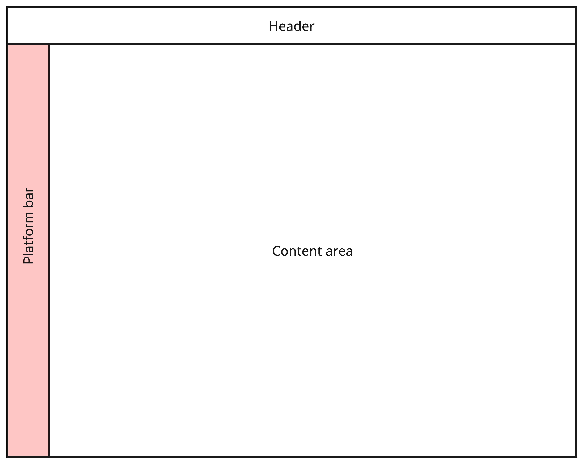
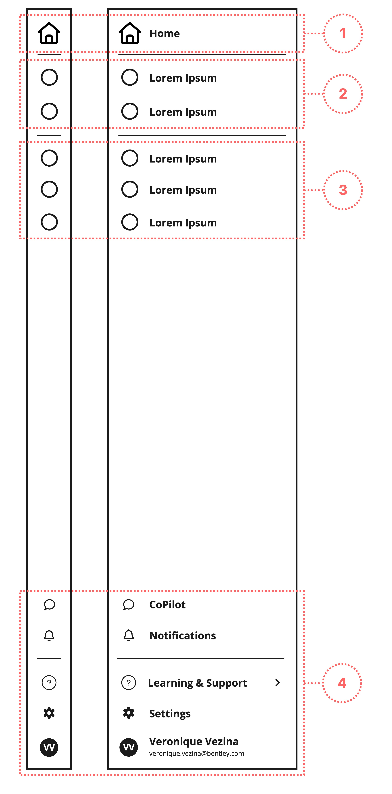
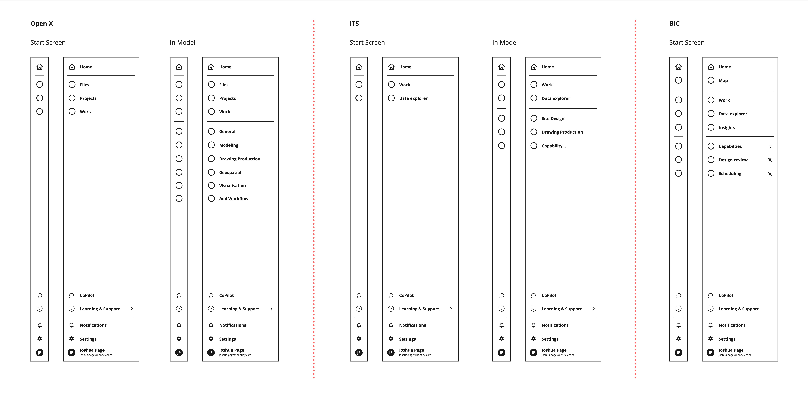

The **Platform Bar** pattern uses the [**Navigation Rail**](/components/navigationrail) component for consistent global navigation. It supports navigation within the current application and between applications in the same ecosystem.

The **Platform Bar** enables predictable navigation patterns that help users remain oriented and move efficiently between primary workflows across products.

## Use cases

Make sure the **Platform Bar** pattern is suitable for your use cases. There may be more appropriate components available.

The Platform Bar helps users to:

- Maintain context while navigating between product's areas
- Build a consistent mental model across products
- Access primary sections and frequently used actions quickly 

| Use case                                                 | Platform Bar ([Navigation Rail](/components/navigationrail)) | [Breadcrumbs](/components/breadcrumbs/) | [Tabs](/components/tabs)                | [Pagination](/components/pagination/)   | [Stepper](/components/stepper)        | [Toolbar](/components/toolbar)         | [Menu](/components/menu) |
| -------------------------------------------------------- | ------------------------------------------------------------ | --------------------------------------- | --------------------------------------- | --------------------------------------- | ------------------------------------- | -------------------------------------- | ------------------------ |
| Top‑level application, product, or portal navigation     | ✅                                                            | ❌                                      | ❌                                      | ❌                                      | ❌                                    | ❌                                     | ❌                        |
| Switching between major product areas or workflows       | ✅                                                            | ❌                                      | ❌                                      | ❌                                      | ❌                                    | ❌                                     | ❌                        |
| Task‑level or contextual actions                         | ❌                                                            | ❌                                      | ❌                                      | ❌                                      | ❌                                    | ✅                                     | ✅                        |
| Deep navigation within a specific workflow               | ❌                                                            | ❌                                      | ❌                                      | ✅                                      | ✅                                    | ❌                                     | ❌                        |
| In‑context navigation                                    | ❌                                                            | ✅                                      | ✅                                      | ❌                                      | ❌                                    | ❌                                     | ❌                        |
 
## Anatomy

The **Platform Bar** is structured as follows.

| Section                      | Purpose                                                                                                                                                                                                          | Component                |
| ---------------------------- | ---------------------------------------------------------------------------------------------------------------------------------------------------------------------------------------------------------------- | ------------------------ |
| 1. **Project home**          | Available only when a project is selected in the header, the project home provides access to project‑specific content.                                                                                           | `NavigationRail.Header`  |
| 2. **Project Overview Tray** | The **Project Overview Tray** serves as a central hub for project‑level information and actions. This tray helps users quickly understand the current state of the project and identify what requires attention. | `NavigationRail.Content` |
| 3. **Capabilities Tray**     | The **Capabilities Tray** provides entry points to the core features, tools, and workflows available to the user.                                                                                                | `NavigationRail.Content` |
| 4. **Utilities**             | Supporting tools and system functions, including notifications, help, application settings, and user profile access.                                                                                             | `NavigationRail.Footer`  |

## Interaction

The **Platform Bar** must conform to certain rules of interaction:

- The **Platform Bar** remains fixed on screen and can be expanded or collapsed to support different workflows.
- The **Platform Bar** remains visible across all core product views. 
- The active navigation item—marked using the [`active` prop](https://stratakit.bentley.com/docs/reference/structures/NavigationRail/#NavigationRail.Anchor.active)—always reflects the user’s current location. 
- Users can navigate between locations without losing data or interrupting in‑progress work. 
- Each navigation item has a suitable [`label`](https://stratakit.bentley.com/docs/reference/structures/NavigationRail/#NavigationRail.Anchor.label), appearing as a tooltip on hover or focus.
- Selecting a navigation item opens a second‑level flyout that adapts to the content height. 
- Users can pin capabilities to appear always first (see BIC's prototype).

## Navigation behavior

When a user activates a navigation item belonging to the **Platform Bar**, certain behaviors are expected. Some of these behaviors must be implemented in-product, since [**Navigation Rail**](/components/navigationrail) cannot anticipate differing routing architectures.

### Navigating screens

In most cases, activating a **Platform Bar** link ([`NavigationRail.Anchor`](/reference/structures/NavigationRail#NavigationRail.Anchor)) will load a new screen. When using a SPA (single-page application) architecture, follow these steps to make the rerouting behavior accessible:

1. Remove the `active` prop from the [`NavigationRail.Anchor`](/reference/structures/NavigationRail#NavigationRail.Anchor) that currently has it.
2. Apply the `active` prop to the newly clicked [`NavigationRail.Anchor`](/reference/structures/NavigationRail#NavigationRail.Anchor).
3. Change the `<title>` text to represent the new screen. See the [advice on `title`](/guides/language-and-labels/#the-page-title) from the **Language & Labels** guide.
4. If the new content cannot be rendered immediately, display a [**Progress**](/components/progress) component. 
5. Send focus to the **Progress** element,  identifying it to screen readers.
6. Remove the **Progress** element and reveal the content.
7. Send focus to the main/introductory heading inside the content. This should be an `<h1>`. See the [headings advice](/guides/structure/#headings) from the **Structure** guide.

:::note[Focus targets]

When sending focus to a non-interactive element, such as a `
`, ensure it has:

1. A semantic role (`<h1>` has a heading role; the **Progress** component has `role="progressbar"`).
2. The element has `tabindex="-1"`. This ensures the target element receives focus as intended.

:::

### Opening dialogs

Occasionally, a navigation action does not load another screen. Instead, it opens a [**Dialog**](/components/dialog/); a kind of screen-within-a-screen. This behavior is acceptable for things like account and app settings. However, you must ensure the following is in place:

1. The navigation item opening the dialog must be a [`NavigationRail.Button`](/reference/structures/NavigationRail#NavigationRail.Button). [`NavigationRail.Anchor`](/reference/structures/NavigationRail#NavigationRail.Anchor) (and the `active` prop) are not applicable.
2. The [**Dialog**](/components/dialog/) must behave as [a modal](https://www.w3.org/WAI/ARIA/apg/patterns/dialog-modal/). This is the default behavior of the [**Dialog**](/components/dialog/) component.
3. The [**Dialog**](/components/dialog/) must have a descriptive `<DialogTitle>`.
4. The [**Dialog**](/components/dialog/), or an interactive element inside the dialog, must receive keyboard focus when the dialog is opened. By default, the outer [**Dialog**](/components/dialog/) is focused.
5. When the [**Dialog**](/components/dialog/) is closed, keyboard focus must be returned to the [`NavigationRail.Button`](/reference/structures/NavigationRail#NavigationRail.Button) that invoked it.

## Examples

